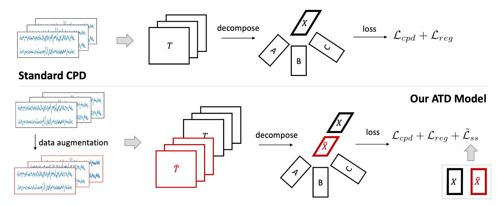

# Data and Codes for NeurIPS'22 Paper - ATD
- ATD: Augmenting CP Tensor Decomposition by Self Supervision

> (The basic idea is very simple) Tensor decomposition can be used as a dimension reduction tool for downstream classification. Then, how to learn tensor subspaces to generate better low-rank features for classification? We consider injecting class-preserving noise, doing tensor augmentation, and then decomposing them together with the self-supervised loss!




> The second interesting thing is that we customize the ALS algorithm for our new objective (including the non-convex self-supervised loss) and build a new optimization algorithm that only uses LEAST SQUARES and FIX-POINT ITERATIONS.

> Our method gives good results (with much fewer parameters) on human signal data, compared to contrastive learning methods, autoencoders, and other tensor decomposition methods.


## Citation
```bibtex
@article{yang2022atd,
  title={ATD: Augmenting CP Tensor Decomposition by Self Supervision},
  author={Yang, Chaoqi and Qian, Cheng and Singh, Navjot and Xiao, Cao and Westover, M Brandon and Solomonik, Edgar and Sun, Jimeng},
  journal={arXiv preprint arXiv:2106.07900},
  year={2022}
}

@article{yang2022atd,
    title = {ATD: Augmenting CP Tensor Decomposition by Self Supervision},
    author = {Yang, Chaoqi and Qian, Cheng and Singh, Navjot and Xiao, Cao and Westover, M Brandon and Solomonik, Edgar and Sun, Jimeng},
    journal = {Advances in Neural Information Processing Systems},
    year = {2022}
}
```

## 1. Quick Start
```bash
# download sample data
cd ./data
wget https://archive.ics.uci.edu/ml/machine-learning-databases/00240/UCI%20HAR%20Dataset.zip
unzip UCI\ HAR\ Dataset.zip; mv UCI\ HAR\ Dataset HAR

# data process and run
python HAR_processing.py; cd ../INT/INT_cp
python main.py --model ATD --reg 1e-3 --R 32 --cuda 0 --epsilon 2 --batch_size 128 --lr 5e-3 --dataset HAR
```

## 2. Dependency
- The running environment only requires some common packages. We specify our running enviroment, some recent versions should also work.
```python
pip install tqdm, PIL
pip install scikit-learn=0.24.1, scipy=1.6.2, numpy==1.20.1
pip install torch==1.8.0+cu111, torchvision=0.90+cu111
pip install transforms3d=0.3.1
```

## 3. Folder Tree
- **./data**
    - Note that: since the most of datasets are large, we only provide a link to their downloads. Users can use our provided scripts to process the raw data into sample based .pkl format.
    - the Sleep-EDF dataset is under Open Data ommons Attribution License v1.0
        - it can be downloaded from https://physionet.org/content/sleep-edfx/1.0.0/
            - ```wget -r -N -c -np https://physionet.org/files/sleep-edfx/1.0.0/```
        - we provide a processing file: **SleepEDF_process.py**
    - the HAR dataset has an open data license contained in their citation (Anguita, 2013)
        - it can be downloaded from https://archive.ics.uci.edu/ml/datasets/human+activity+recognition+using+smartphones
            - ```wget https://archive.ics.uci.edu/ml/machine-learning-databases/00240/UCI%20HAR%20Dataset.zip```
        - we provide a processing file: **HAR_processing.py**
    - the PTB-XL is under Open BSD 3.0
        - it can be downloaded from https://physionetchallenges.org/2020/ (which also includes other same-formatted datasets)
            - ```wget https://physionet.org/content/ptb-xl/1.0.1/```
        - we provide a processing file: **ecg_processing.py** (this can also be used for other dataset in the same site)
- **./INT/INT_cp**
    - **utils.py**: the data loader file (for Sleep-EDF, HAR, PTB-XL, MGH)
    - **model.py**: contains the ATD and SALS model
    - **main.py**: the script to run stochastic tensor decomposition model
- **./INT/INT_ss**
    - **utils.py**: the data loader file (for Sleep-EDF, HAR, PTB-XL, MGH)
    - **loss.py**: the loss function of self-supervised learning model (input two embedding batch, output a loss)
    - **model.py**: the ResNet based CNN encoders (turn data samples into embedding) and autoencoders
    - **AE_train.py**: the script to run AE and AE_ss model
    - **ss_train.py**: the script to run BYOL and SimCLR model


## 4. Instructions on Using the Codes (HAR Dataset as an example)

For each dataset, e.g., **HAR**, we recommend users to have such folder: **./HAR/processed/pretext** (contains unlabeled samples), **./HAR/processed/train** for labeled training data and **./HAR/processed/train** for labeled test data. Within each folder, the sample file will be named as xxx-index.pkl, while each of the file is a **data sample with format {'X': the raw signal epoch, 'y': the extracted label}**. This is important! When running the model, the data will not be loaded into memory at once. We will use data loader to read xxx-index.pkl files as data samples and form batches to train the model, so SSD disk is also highly recommended.

#### 4.1 data downloading and processing
```bash
cd ./data
wget https://archive.ics.uci.edu/ml/machine-learning-databases/00240/UCI%20HAR%20Dataset.zip
unzip UCI\ HAR\ Dataset.zip
mv UCI\ HAR\ Dataset HAR
python HAR_processing.py
```
The processed data will be stored in ./data/HAR/processed into three folders pretext/train/text (example code snippets for train folder)
```python
for index in train_index:
    path = './HAR/processed/train/sample-{}.pkl'.format(index)
    pickle.dump({'X': X[:, index, :], 'y': y[index]}, open(path, 'wb')) # data format
```

#### 4.2 running baselines
```python

# self-supervised models
cd ./INT/INT_ss
python -W ignore ss_train.py --model SimCLR --cuda 0 --lr 1e-3 --n_dim 32 --batch_size 128 --dataset HAR # SimCLR-32
python -W ignore ss_train.py --model BYOL --cuda 0 --lr 1e-3 --n_dim 32 --batch_size 128 --dataset HAR # BYOL-32

# autoencoder models
cd ./INT/INT_ss
python -W ignore AE_train.py --model AE --cuda 0 --lr 1e-3 --n_dim 32 --batch_size 128 --dataset HAR # AE-32
python -W ignore AE_train.py --model AE_SS --cuda 0 --lr 1e-3 --n_dim 32 --batch_size 128 --dataset HAR # AE_{ss}-32

# tensor decomposition models
cd ./INT/INT_cp
python main.py --model SALS --reg 1e-3 --R 32 --cuda 0 --epsilon 2 --batch_size 128 --lr 5e-3 --dataset HAR # SALS
python main.py --model GR_SALS --reg 1e-3 --R 32 --cuda 0 --epsilon 2 --batch_size 128 --lr 5e-3 --dataset HAR # GR_SALS
python main.py --model ATD --reg 1e-3 --R 32 --cuda 0 --epsilon 0 --batch_size 128 --lr 5e-3 --dataset HAR # ATD_{ss-}
python main.py --model ATD --reg 1e-3 --R 32 --cuda 0 --epsilon 2 --batch_size 128 --lr 5e-3 --dataset HAR # ATD
```

## 5. Reference Configurations
We provide the reference configurations for each experiments. For tensor based methods, "reg" is "alpha", "epsilon" is "beta" in our paper. The configuration "epsilon" will not affect SALS and GR_SALS model. We set "epsilon=0" for ATD_{ss-} model. Note that, the results might change little due to the randomness in data splitting and parameter tunning.

```python
# for Sleep-EDF
python -W ignore ss_train.py --model SimCLR --cuda 0 --lr 1e-3 --n_dim 32 --batch_size 128 --dataset SLEEP
python -W ignore ss_train.py --model SimCLR --cuda 1 --lr 1e-3 --n_dim 128 --batch_size 128 --dataset SLEEP
python -W ignore ss_train.py --model BYOL --cuda 0 --lr 1e-3 --n_dim 32 --batch_size 128 --dataset SLEEP
python -W ignore ss_train.py --model BYOL --cuda 1 --lr 1e-3 --n_dim 128 --batch_size 128 --dataset SLEEP

python -W ignore AE_train.py --model AE --cuda 0 --lr 1e-3 --n_dim 32 --batch_size 128 --dataset SLEEP
python -W ignore AE_train.py --model AE --cuda 1 --lr 1e-3 --n_dim 128 --batch_size 128 --dataset SLEEP
python -W ignore AE_train.py --model AE_SS --cuda 0 --lr 1e-3 --n_dim 32 --batch_size 128 --dataset SLEEP
python -W ignore AE_train.py --model AE_SS --cuda 1 --lr 1e-3 --n_dim 128 --batch_size 128 --dataset SLEEP

python main.py --model SALS --reg 1e-3 --R 32 --cuda 0 --epsilon 2 --batch_size 128 --lr 1e-3 --dataset SLEEP
python main.py --model GR_SALS --reg 1e-3 --R 32 --cuda 0 --epsilon 2 --batch_size 128 --lr 1e-3 --dataset SLEEP
python main.py --model ATD --reg 1e-3 --R 32 --cuda 0 --epsilon 0 --batch_size 128 --lr 1e-3 --dataset SLEEP
python main.py --model ATD --reg 1e-3 --R 32 --cuda 1 --epsilon 2 --batch_size 128 --lr 1e-3 --dataset SLEEP

# for PTB-XL (called WFDB in our folder)
python -W ignore ss_train.py --model SimCLR --cuda 0 --lr 1e-3 --n_dim 32 --batch_size 128 --dataset WFDB
python -W ignore ss_train.py --model SimCLR --cuda 1 --lr 1e-3 --n_dim 128 --batch_size 128 --dataset WFDB
python -W ignore ss_train.py --model BYOL --cuda 2 --lr 1e-3 --n_dim 32 --batch_size 128 --dataset WFDB
python -W ignore ss_train.py --model BYOL --cuda 3 --lr 1e-3 --n_dim 128 --batch_size 128 --dataset WFDB

python -W ignore AE_train.py --model AE --cuda 0 --lr 1e-3 --n_dim 32 --batch_size 128 --dataset WFDB
python -W ignore AE_train.py --model AE --cuda 1 --lr 1e-3 --n_dim 128 --batch_size 128 --dataset WFDB
python -W ignore AE_train.py --model AE_SS --cuda 2 --lr 1e-3 --n_dim 32 --batch_size 128 --dataset WFDB
python -W ignore AE_train.py --model AE_SS --cuda 3 --lr 1e-3 --n_dim 128 --batch_size 128 --dataset WFDB

python main.py --model SALS --reg 1e-3 --R 32 --cuda 0 --epsilon 2 --batch_size 128 --lr 5e-3 --dataset WFDB
python main.py --model GR_SALS --reg 1e-3 --R 32 --cuda 0 --epsilon 2 --batch_size 128 --lr 5e-3 --dataset WFDB
python main.py --model ATD --reg 1e-3 --R 32 --cuda 2 --epsilon 0 --batch_size 128 --lr 5e-3 --dataset WFDB
python main.py --model ATD --reg 1e-3 --R 32 --cuda 1 --epsilon 2 --batch_size 128 --lr 5e-3 --dataset WFDB

# for HAR
python -W ignore ss_train.py --model SimCLR --cuda 0 --lr 1e-3 --n_dim 32 --batch_size 128 --dataset HAR
python -W ignore ss_train.py --model SimCLR --cuda 1 --lr 1e-3 --n_dim 128 --batch_size 128 --dataset HAR
python -W ignore ss_train.py --model BYOL --cuda 2 --lr 1e-3 --n_dim 32 --batch_size 128 --dataset HAR
python -W ignore ss_train.py --model BYOL --cuda 3 --lr 1e-3 --n_dim 128 --batch_size 128 --dataset HAR

python -W ignore AE_train.py --model AE --cuda 0 --lr 1e-3 --n_dim 32 --batch_size 128 --dataset HAR
python -W ignore AE_train.py --model AE --cuda 1 --lr 1e-3 --n_dim 128 --batch_size 128 --dataset HAR
python -W ignore AE_train.py --model AE_SS --cuda 2 --lr 1e-3 --n_dim 32 --batch_size 128 --dataset HAR
python -W ignore AE_train.py --model AE_SS --cuda 3 --lr 1e-3 --n_dim 128 --batch_size 128 --dataset HAR

python main.py --model SALS --reg 1e-3 --R 32 --cuda 0 --epsilon 2 --batch_size 128 --lr 5e-3 --dataset HAR
python main.py --model GR_SALS --reg 1e-3 --R 32 --cuda 0 --epsilon 2 --batch_size 128 --lr 5e-3 --dataset HAR
python main.py --model ATD --reg 1e-3 --R 32 --cuda 1 --epsilon 0 --batch_size 128 --lr 5e-3 --dataset HAR
python main.py --model ATD --reg 1e-3 --R 32 --cuda 2 --epsilon 2 --batch_size 128 --lr 5e-3 --dataset HAR

# for MGH
python -W ignore ss_train.py --model SimCLR --cuda 0 --lr 1e-3 --n_dim 32 --batch_size 128 --dataset MGH
python -W ignore ss_train.py --model SimCLR --cuda 1 --lr 1e-3 --n_dim 128 --batch_size 128 --dataset MGH
python -W ignore ss_train.py --model BYOL --cuda 0 --lr 1e-3 --n_dim 32 --batch_size 128 --dataset MGH
python -W ignore ss_train.py --model BYOL --cuda 1 --lr 1e-3 --n_dim 128 --batch_size 128 --dataset MGH

python -W ignore AE_train.py --model AE --cuda 0 --lr 1e-3 --n_dim 128 --batch_size 128 --dataset MGH
python -W ignore AE_train.py --model AE --cuda 0 --lr 1e-3 --n_dim 32 --batch_size 128 --dataset MGH
python -W ignore AE_train.py --model AE_SS --cuda 1 --lr 1e-3 --n_dim 128 --batch_size 128 --dataset MGH
python -W ignore AE_train.py --model AE_SS --cuda 1 --lr 1e-3 --n_dim 32 --batch_size 128 --dataset MGH

python main.py --model SALS --reg 1e-3 --R 32 --cuda 0 --epsilon 2 --batch_size 512 --lr 1e-3 --dataset MGH
python main.py --model GR_SALS --reg 1e-3 --R 32 --cuda 0 --epsilon 2 --batch_size 512 --lr 1e-3 --dataset MGH
python main.py --model ATD --reg 1e-3 --R 32 --cuda 1 --epsilon 0 --batch_size 512 --lr 1e-3 --dataset MGH
python main.py --model ATD --reg 1e-3 --R 32 --cuda 2 --epsilon 2 --batch_size 512 --lr 1e-3 --dataset MGH
```