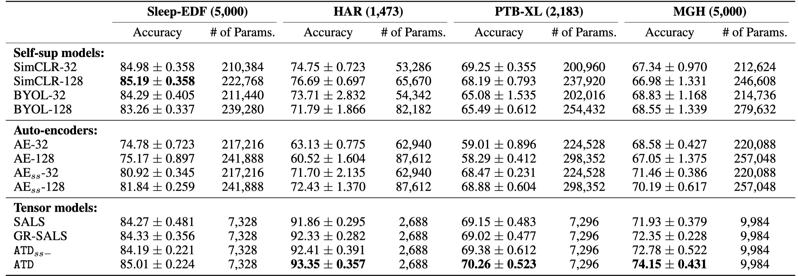

# Self-supervised Tensor Decomposition for Better Downstream Classification

This blog is written to introduce our recent NeurIPS 2022 paper: **ATD: Augmenting CP Tensor Decomposition by Self Supervision.** 

The paper introduces a new canonical polyadic tensor decomposition (CPD) approach empowered by self-supervised learning (SSL), which generates unsupervised embeddings that gives better downstream classification performance.

## A 5-min Summary 
Tensor decomposition can be used as a dimension reduction tool for downstream classification. However, traditional tensor decomposition methods focus on low-rank fitness and does not consider the downstream tasks (such as classification).

**Contribution 1:** This paper solves the problem of "how to learn tensor decomposition subspaces to generate better low-rank features for classification". We consider injecting class-preserving perturbations by tensor augmentation and then decomposing the tensor and the perturbed tensor together with the self-supervised loss!

**Contribution 2:** For optimization, we improve the ALS algorithm for our new loss functions (including the non-convex self-supervised loss). Specifically, we build a new optimization algorithm that only uses least squares optimization and fix-point iteration for solving the non-convex subproblem.

Our method gives good results (with much fewer parameters) on human signal data, compared to contrastive learning methods, autoencoders, and other tensor decomposition methods.

---

We explain more details below.

## 1. Feature Dimension Reduction

**Unsupervised Learning:** Tensor decomposition and self-supervised learning are two types of unsupervised learning methods. They learn the encoders from unlabeled datasets and generate feature representations (e.g., 128-dim vectors) for each data sample. During the whole learning process, no label information is needed. 

**Downstream Evaluation:** The learned representations can be used as the input features for downstream classification with a separate linear model (e.g., logistic regression, which takes 128-dim vectors as input and predicts the label).

### 1.1 CP tensor decomposition

Canonical polyadic tensor decomposition (CPD) is commonly used to learn the low-rank factors of a tensor (e.g., higher-dimensional matrix). Standard CPD follows the **fitness principle**: approximating the original tensor as far as possible with the low-rank factors.

> Formally, assume the tensor is $\mathcal{T}\in\mathbb{R}^{I_1\times I_2\times\cdots\times I_K}$, the resulting $R$-rank factors can have the following dimensions: $\{A_i\in\mathbb{R}^{I_i\times R}: i\in[1,\dots,K]\}$. Frobenius norm is commonly chosen as the fitness loss for learning the low-rank factors. 

**Example:** we use multi-channel EEG signals for example. Assume each EEG signal has two channels (two blue time series in one slice). Now, we stack $N$ data samples (denoted as $T_1,T_2,...$) together and make them a 3-dimensional tensor $\mathcal{T}$: $N~samples\times channels \times timesteps$.

We use CPD to learn low-rank factors: $X$ for the sample dimension, $A$ for the channel dimension, and $B$ for the timesteps dimension. Corresponding columns of these three matrices will generate rank-one components one by one, and collectively the components can approximate the tensor $\mathcal{T}$. With more components (i.e., rank $R$), the approximation is generally better. However, more components are likely to capture unnecessary noise in the data. 

With a properly chosen rank $R$, the learned factors can capture the low-rank structure of the tensor and will be the feature representations for different information aspects. For example, rows in $X$ are the representation of data samples; each row in $A$ is the representation of a channel. **From the fitness perspective, $X$ contains the data representations learned in CPD.**

### 1.2 Self-supervised contrastive learning

Self-supervised contrastive learning (SSL) has become popular in the recent few years. SSL methods are mostly deep learning-based and can be used as unsupervised feature extractors. 

> STEP 1: Given an unlabeled sample $T$, SSL methods will apply two class-preserving data augmentations (i.e., though we do not know the label of $x$, we know that after applying the data augmentation, $T$ will change and the underlying label will not change) and obtain the perturbed samples $T'$ and $T''$.
> 

> STEP 2: SSL methods apply the parameterized feature encoder $Enc(\cdot)$ on $T'$ and $T''$, and obtain two representations $x'$ and $x''$. Optionally, people also append one non-linear projection to obtain $z'$ and $z''$.
> 

> STEP 3: A common contrastive loss is to maximize the similarity of $z'$ and $z''$ with respect to the similarity of $z'$ and other embedding vectors $z_{other}$  from the same data batch.
> 

**Example:** For the same set of unlabeled EEG signals, we stack them as a data batch and feed them into the typical SSL pipeline. During the learning process, the SSL models will align the embeddings for perturbed samples from the same data and disalign the embeddings for perturbed samples from different data.

**From the alignment principle, the model will learn an unsupervised feature encoder that generates embeddings invariant to data augmentations.**

## 2. Introducing SSL to CPD

**Motivations:** So far, we know that both the CPD-type methods and the SSL-type methods can learn to extract feature representations from data samples in an unsupervised way. The CPD-type methods need far fewer parameters than deep-learning methods while it does not consider the downstream classification; The SSL-type methods are flexible and generalizable to other frameworks, and the representations are learned from a class-preserving perspective. However, it needs much more parameters than tensor methods.

**The paper “ATD: Augmenting CP Tensor Decomposition by Self Supervision” introduces the self-supervised learning concept into tensor decomposition and seamlessly combines their advantages.**  Let us look at the framework below.

## 3. Unbiased Estimator for Negative Loss

## 4. Improved ALS algorithm

## 5. Experiments