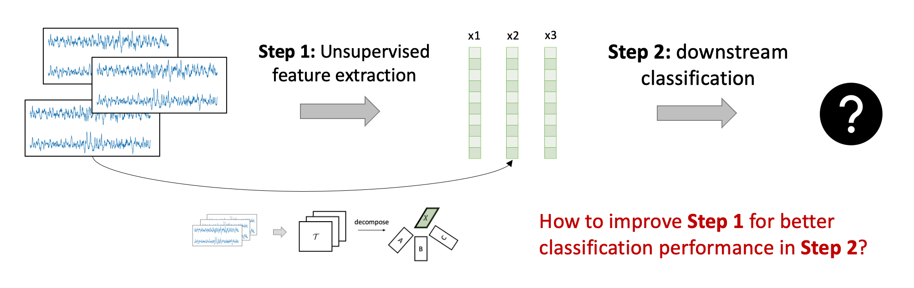
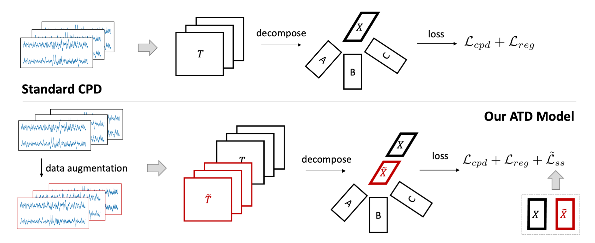
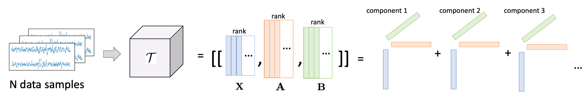
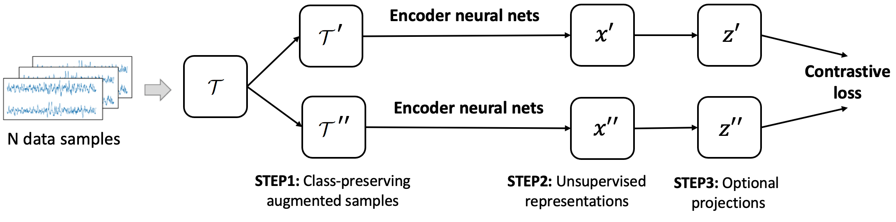
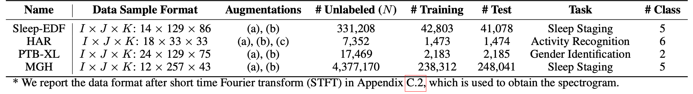
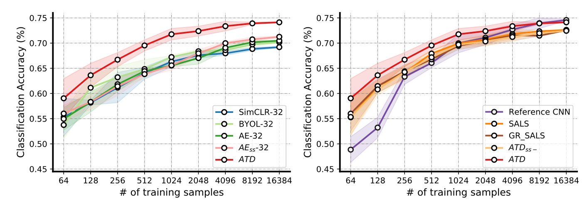

# Self-supervised Tensor Decomposition

This blog is written to introduce our recent NeurIPS 2022 paper [1]: **ATD: Augmenting CP Tensor Decomposition by Self Supervision.** 

The paper proposes a new canonical polyadic tensor decomposition (CPD) approach empowered by self-supervised learning (SSL), which generates unsupervised embeddings (Step 1) that can give better downstream classification performance (Step 2).



---

## A 5-min Summary 
Tensor decomposition can be used as a dimension reduction tool for downstream classification. However, traditional tensor decomposition methods focus on low-rank fitness and does not consider the downstream tasks (such as classification).

**Contribution 1:** This paper solves the problem of "how to learn better tensor decomposition subspaces and generate predictive low-rank features for downstream classification". We consider injecting class-preserving perturbations by tensor augmentation and then decomposing the tensor and the perturbed tensor together with the self-supervised loss!



**Contribution 2:** For optimization, we improve the ALS algorithm for our new loss functions (including the non-convex self-supervised loss). Specifically, we build a new optimization algorithm that only uses least squares optimization and fix-point iteration for solving the non-convex subproblem.

Our method gives good results (with much fewer parameters) on four human signal datasets, compared to contrastive learning methods, autoencoders, and other tensor decomposition methods.


---

We explain more details below.

## 1. Feature Dimension Reduction

**Unsupervised Learning:** Tensor decomposition and self-supervised learning are two types of unsupervised learning methods. They learn the encoders from unlabeled datasets and generate feature representations (e.g., 128-dim vectors) for each data sample. During the whole learning process, no label information is needed. 

**Downstream Evaluation:** The learned representations are used as the feature inputs for downstream classification where a separate linear model is trained (e.g., logistic regression, which takes 128-dim vectors as input and predicts the label).

### CP tensor decomposition

Canonical polyadic tensor decomposition (CPD) [2] is commonly used to learn the low-rank factors of a tensor (e.g., higher-dimensional matrix). Standard CPD follows the **fitness principle**: approximating the original tensor as far as possible with the low-rank factors.

> Formally, assume the tensor is $\mathcal{T}\in\mathbb{R}^{I_1\times I_2\times\cdots\times I_K}$, the resulting $R$-rank factors can have the following dimensions: $\{A_i\in\mathbb{R}^{I_i\times R}: i\in[1,\dots,K]\}$. Frobenius mean square error (MSE) is commonly chosen as the fitness loss for learning the low-rank factors. 

**Example:** we use multi-channel EEG signals for example. Assume each EEG signal has two channels (two blue time series in one slice). Now, we stack $N$ data samples (denoted as $T_1,T_2,...$) together and make it a 3-dimensional tensor $\mathcal{T}$: $N~samples\times channels \times timesteps$.



We use CPD to learn low-rank factors: $X$ for the sample dimension, $A$ for the channel dimension, and $B$ for the timesteps dimension. Corresponding columns of these three matrices will generate rank-one components one by one, and collectively the components can approximate the tensor $\mathcal{T}$. With more components (i.e., rank $R$), the approximation is generally better. However, more components are likely to capture unnecessary noise in the data. 

With a properly chosen rank $R$, the learned factors can capture the low-rank structure of the tensor and will be the feature representations for different information aspects. For example, **rows in $X$ are the representation of data samples**; each row in $A$ is the representation of a channel.

### Self-supervised contrastive learning

Self-supervised contrastive learning (SSL) [3][4] has become popular in the recent few years. SSL methods are mostly deep learning-based and can be used as unsupervised feature extractors. 

> STEP 1: Given an unlabeled sample $T$, SSL methods will apply two class-preserving data augmentations (i.e., though we do not know the label of $x$, we know that after applying the data augmentation, $T$ will change a bit and the underlying label will not change) and obtain the perturbed samples $T'$ and $T''$.

> STEP 2: SSL methods apply the parameterized feature encoder $Enc(\cdot)$ on $T'$ and $T''$, and obtain two representations $x'$ and $x''$. Optionally, people may also append one non-linear projection to obtain $z'$ and $z''$.

> STEP 3: A common contrastive loss (e.g., noise contrastive estimation, NCE [5]) is to maximize the similarity of $z'$ and $z''$ with respect to the similarity of $z'$ and other embedding vectors $z_{other}$  from the same data batch.


**Example:** For the same set of unlabeled EEG signals, we stack them as a data batch and feed them into the typical SSL pipeline. During the learning process, the SSL models will align the embeddings of perturbed samples from the same data and disalign the embeddings of perturbed samples from different data.



From the alignment principle, the SSL model can also generate meaningful unsupervised features by leveraging $Enc(\cdot)$.


## 2. Introducing SSL to CPD

### Motivations

So far, we know that both the CPD-type methods and the SSL-type methods can extract feature representations from data samples in an unsupervised way. The CPD-type methods need far fewer parameters than deep-learning methods while it typically does not consider the downstream classification; The SSL-type methods are flexible and generalizable to other frameworks, and the representations are learned from a class-preserving perspective. However, it needs much more parameters than tensor methods.

Inspired by this, **the paper “ATD: Augmenting CP Tensor Decomposition by Self Supervision” introduces the self-supervised learning concept into tensor decomposition and seamlessly combines their advantages (the framework is shown below).** In the figure, each tensor slice is an unlabeled data sample. We integrate the concept of self-supervised learning by the following steps:

- **Step 1: data augmentation:** We apply data augmentations to each tensor slice (such as bandpass filtering, jittering, coordinate rotation, see our paper [1]);
- **Step 2: tensor decomposition:** We stack the tensor $\mathcal{T}$ and the perturbed tensor $\mathcal{T}'$ together and apply tensor decomposition algorithm (here we use CPD). The loss functions are standard regularizer and the fitness loss as well as the self-supervised loss.  


There are some technical details in loss design and optimization. In this blog, we briefly mention it below, but we encourage the user to refer to our paper [1].

### Our Self-supervised Loss

In the SSL domain, the noise contrastive estimation (NCE) loss is widely used, which aims to maximize the similarity of positive pairs and minimize the similarity of negative pairs. However, NCE loss is based on the non-convex softmax form and may not be amenable for alternating least squares type algorithm. Also, the claimed negative samples in common SSL practice are actually random samples. In this paper, we first utilize the law of total probability to **find the negative samples in an unbiased way**. Then, we propose **a new subtraction-formed self-supervised loss**, which still follows the alignment principle (maximizing positive pairs and minimizing negative pairs) but is amenable to work with traditional optimization tools, as discussed below.

### Improved ALS Optimization

The new self-supervised loss form is still non-convex with respect to the low-rank data representation $\mathbf{X}$ and $\mathbf{X}'$. In this paper, we use fix-point iteration to solve the non-convex subproblem. The overall optimization flow still follows alternating fashion, and we use **a combination of fix-point iteration and least squares optimization** and do not rely on the ```auto-grad`` backpropagation function of PyTorch or TensorFlow. 

## 3. Experiments
Let us look at the performance of our prosed ATD on four human signal datasets: (i) an EEG dataset Sleep-EDF; (ii) an ECG dataset PTB-XL; (iii) an human activity recognition (HAR) dataset; and (iv) a proprietary EEG dataset from Massachusetts General Hospital (MGH), while the first three are open. Their statistics are shown below.




### Accuracy and Complexity Comparison

The overall comparison with baselines models are given below, ATD shows comparable or better performance over the baselines. Basically, we can conclude that it is useful to consider both fitness and alignment as part of the objective. The table also shows that tensor based models require fewer parameters, i.e., less than 5% of parameters compared to deep learning models.


### Fewer Training Samples

On the MGH dataset, we show the effect of varying the amount of training data below while fixing the test set. As a reference, we include an end-to-end supervised CNN model, called Reference CNN. To prevent overlapping, we separate the comparison figure into two sub-figures: the left compares with self-supervised and auto-encoder baselines and the right one compares with tensor baselines and the reference model. We find that all unsupervised models outperform the supervised reference CNN model in scenarios with fewer training samples. With more training data, the performance of all models get improved, especially the reference CNN model.



---

We have open-sourced our code in https://github.com/ycq091044/ATD.

[1] Yang, Chaoqi, Cheng Qian, Navjot Singh, Cao Xiao, M. Brandon Westover, Edgar Solomonik, and Jimeng Sun. "ATD: Augmenting CP Tensor Decomposition by Self Supervision." Advances in Neural Information Processing Systems. 2022.

[2] Kolda, Tamara G., and Brett W. Bader. "Tensor decompositions and applications." SIAM review 51.3 (2009): 455-500.

[3] He, Kaiming, Fan, Haoqi, Wu, Yuxin, Xie, Saining, Girshick, Ross. "Momentum contrast for unsupervised visual representation learning." Proceedings of the IEEE/CVF conference on computer vision and pattern recognition. 2020.

[4] Chen, Ting, Kornblith, Simon, Norouzi, Mohammad, Hinton, Geoffrey. "A simple framework for contrastive learning of visual representations." International conference on machine learning. PMLR, 2020.

[5] Gutmann, Michael, and Aapo Hyvärinen. "Noise-contrastive estimation: A new estimation principle for unnormalized statistical models." Proceedings of the thirteenth international conference on artificial intelligence and statistics. JMLR Workshop and Conference Proceedings, 2010.